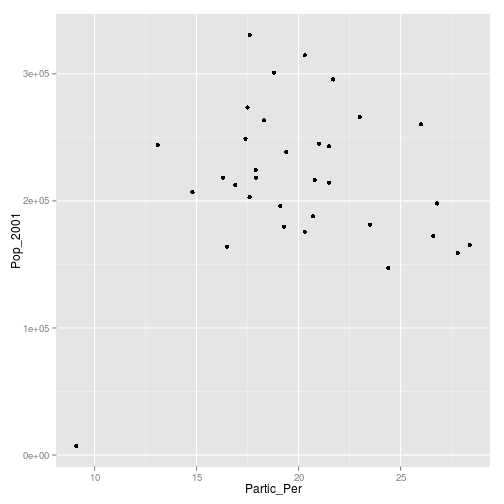
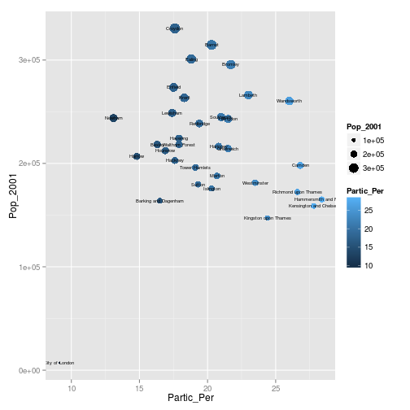
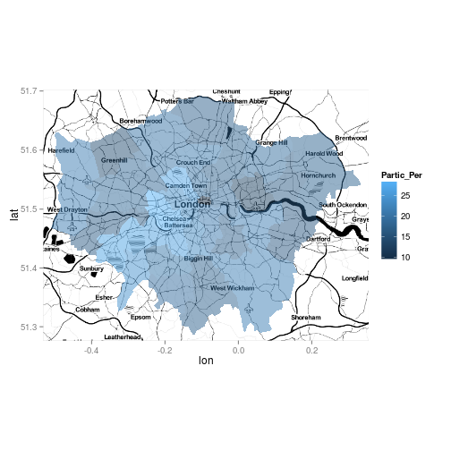
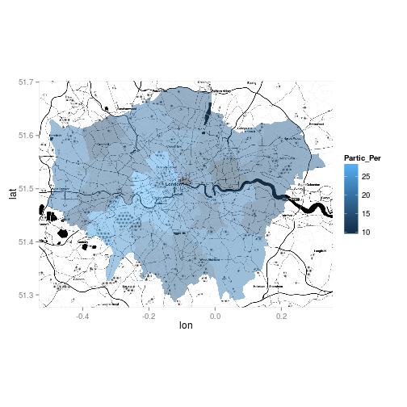
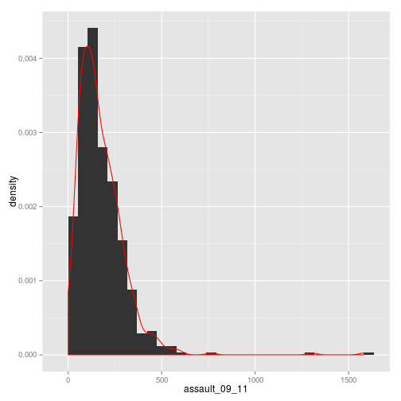
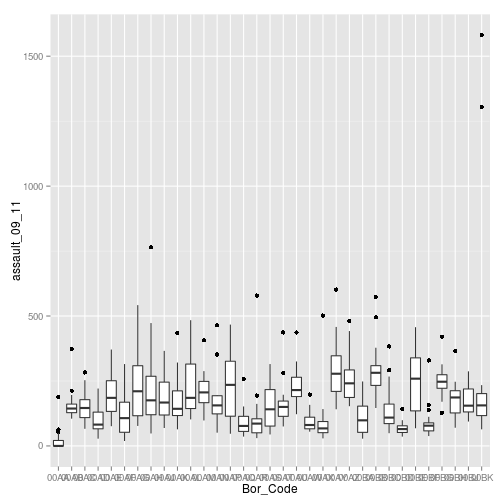
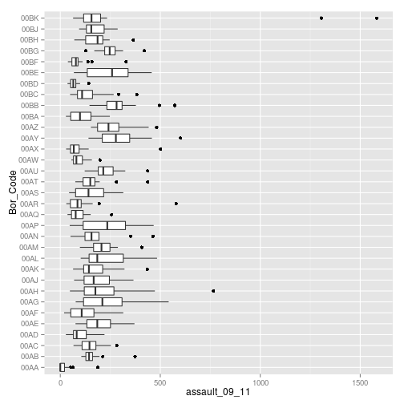
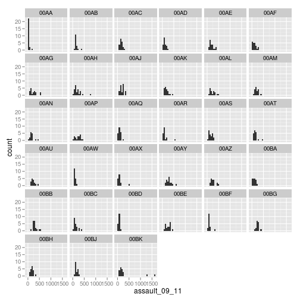
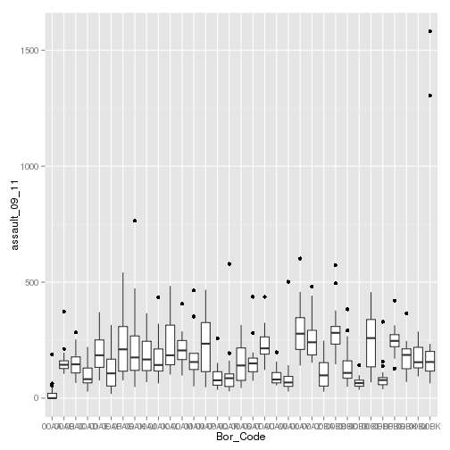

Introduction to Spatial Data and ggplot2
========================================================

Building on the introduction provided by the previous worksheet, the next set of exercises are concerned with specific functions for spatial data and also the use of a package called ggplot2 for data visualisation.

## Spatial Data

R has a huge (and growing) number of spatial data packages. On your own machine these are easily installed with the help of the "ctv" package.


```r
install.packages("ctv")
library(ctv)
# install.views('spatial') # This step will download and install all the
# spatial packages available in R.  You will not need to do this step today,
# so it is commented out
```


You will need to download the practical’s data from here: 

https://www.dropbox.com/sh/0z9a0hrn72poql5/Bx3rgWZ0kN

Save this to a new folder, then in R specify the path of that folder as you working directory.
If your username is "username" and you saved the files into a 
folder called "rmapping" into your Desktop, for example, 
you would type the following:


```r
setwd("C:/Users/username/Desktop/rmapping/R")
```


If you are working in RStudio, it is worth setting up a project that will automatically 
set your working directory. One of the most important steps in handling spatial data with R 
is the ability to read in shapefiles. There are a number of ways to do this. 
The most simple is `readShapePoly()` in the `maptools` package:


```r
library(maptools)  # load the package
sport <- readShapePoly("london_sport.shp")  # read in the shapefile
```


This method works OK, but it is no longer considered best 
practice since it doesn’t load in the spatial referencing information 
etc associated with the shapefile.
A more powerful way to read in geographical data is to use the `rgdal` function 
`readOGR`, which automatically extracts this information.
This is R’s interface to the "Geospatial Abstraction Library (GDAL)"
which is used by other open source GIS packages such as QGIS and enables 
R to handle a broader range of spatial data formats.


```r
library(rgdal)
```

```
## Loading required package: sp
## rgdal: version: 0.8-10, (SVN revision 478)
## Geospatial Data Abstraction Library extensions to R successfully loaded
## Loaded GDAL runtime: GDAL 1.10.0, released 2013/04/24
## Path to GDAL shared files: /usr/share/gdal/1.10
## Loaded PROJ.4 runtime: Rel. 4.8.0, 6 March 2012, [PJ_VERSION: 480]
## Path to PROJ.4 shared files: (autodetected)
```

```r
sport <- readOGR(dsn = ".", "london_sport")
```

```
## OGR data source with driver: ESRI Shapefile 
## Source: ".", layer: "london_sport"
## with 33 features and 4 fields
## Feature type: wkbPolygon with 2 dimensions
```


In the code above dsn stands for "data source name" which is often the folder containing the spatial data – this was pre-specified when you set your working directory – and then the text in " " following the comma is the name of the file required. There is no need to add a file extension. The file contains the borough population and the percentage of the population engaging in sporting activities, and was taken from the file "active-people-survey-participation" available from
[data.london.gov.uk](http://data.london.gov.uk/datastore/package/active-people-survey-participation).
The boundary data is from the OS Opendata Scheme: http://www.ordnancesurvey.co.uk/oswebsite/opendata/ .

All shapefiles have an attribute table. This is loaded with `readOGR` and can be treated in a similar way to a `data.frame`. 

R hides the geometry of spatial data unless you print the object (using the `print()`). 
Let's take a look at the headings of sport, using the following command: `names(sport)`
The data contained in spatial data are kept in a 'slot' that can be accessed using 
the @ symbol:


```r
sport@data
```


This is useful if you do not wish to work with the spatial components of the data at all times. 

Type `summary(sport)` to get some additional information about the data object. Spatial objects in R contain a variety of additional information:

```
Object of class SpatialPolygonsDataFrame
Coordinates:
       min      max
x 503571.2 561941.1
y 155850.8 200932.5
Is projected: TRUE 
proj4string :
[+proj=tmerc +lat_0=49 +lon_0=-2 +k=0.9996012717 +x_0=400000 +y_0=-100000
+ellps=airy +units=m +no_defs]
```

In the above code `proj4string` represents the coordinate reference system used in the data. 
In this file it has been incorrectly specified so we can change it with the following:


```r
proj4string(sport) <- CRS("+init=epsg:27700")
```

```
## Warning: A new CRS was assigned to an object with an existing CRS:
## +proj=tmerc +lat_0=49 +lon_0=-2 +k=0.9996012717 +x_0=400000 +y_0=-100000 +ellps=airy +units=m +no_defs
## without reprojecting.
## For reprojection, use function spTransform in package rgdal
```


You will see you get a warning. This is saying that you are simply changing the coordinate reference system and not reprojecting the data. Epsg:27700 is the code for British National Grid. If we wanted to reproject the data into something like WGS84 for latitude and longitude we would use the following code:


```r
sport.wgs84 <- spTransform(sport, CRS("+init=epsg:4326"))
```


The different epsg codes are a bit of hassle to remember but you can find them all here: 
http://spatialreference.org/

## ggplot2

This next section of the practical introduces a slightly different method of creating plots in R using the ggplot2 
package. The package is an implementation of Leland Wilkinson's Grammar of Graphics - 
a general scheme for data visualization that breaks up graphs into semantic components such as scales and layers. 
ggplot2 can serve as a replacement for the base graphics in R (the functions you have been plotting with today) and contains a number of default options that match good visualisation practice.

The maps we produce will not be that meaningful - 
the focus here is on sound visualisation with R and not sound analysis 
(obviously the value of the former diminished in the absence of the latter!)
Whilst the instructions are step by step you are encouraged to deviate from them 
(trying different colours for example) to get a better understanding of what we are doing. 

`ggplot2` is one of the best documented packages in R. 
The full documentation for it can be found online and it is recommended you 
test out the examples on your own machines and play with them:

http://docs.ggplot2.org/current/

here is also a cookbook for R with some nice examples:

http://wiki.stdout.org/rcookbook/Graphs/

Load the packages:


```r
library(ggplot2)
```


It is worth noting that the basic `plot()` function requires no 
data preparation but additional effort in colour selection/adding the map key etc. 
`qplot()` and `ggplot()` (from the ggplot2 package) 
require some additional steps to format the spatial data but select 
colours and add keys etc automatically. More on this later.

As a first attempt with ggplot2 we can create a scatter plot with the attribute data in the sport object created above. Type:


```r
p <- ggplot(sport@data, aes(Partic_Per, Pop_2001))
```


What you have just done is set up a ggplot object where you say where you want the input data to come from. `sport@data` is actually a data frame contained within the 
wider spatial object `sport` (the `@` enables you to access the attribute table of the 
sport shapefile).  The characters inside the `aes` argument
refer to the parts of that data frame you wish to use (the variables `Partic_Per` and `Pop_2001`).
This has to happen within the brackets of `aes()`, which means, 
roughly speaking 'aesthetics that vary'.  
If you just type p and hit enter you get the error `No layers in plot`. 
This is because you have not told ggplot what you want 
to do with the data. We do this by adding so-called "geoms", 
in this case `geom_point()`.


```r
p + geom_point()
```

 


Within the brackets you can alter the nature of the points. Try something like `p + geom_point(colour = "red", size=2)` and experiment. 

If you want to scale the points by borough population and colour them by sports participation this is also fairly easy by adding another `aes()` argument.


```r
p + geom_point(aes(colour = Partic_Per, size = Pop_2001))
```


The real power of ggplot2 lies in its ability to add layers to a plot. In this case we can add text to the plot.


```r
p + geom_point(aes(colour = Partic_Per, size = Pop_2001)) + geom_text(size = 2, 
    aes(label = name))
```

 


This idea of layers (or geoms) is quite different from the standard plot functions in R, but you will find that each of the functions  does a lot of clever stuff to make plotting much easier (see the documentation for a full list). 
 
The following steps will create a map to show the percentage of the population in each London Borough who regularly participate in sports activities. 

To get the shapefiles into a format that can be plotted we have to use the `fortify()` function. Spatial objects in R have a number of slots containing the various items of data (polygon geometry, projection, attribute information) associated with a shapefile. Slots can be thought of as shelves within the data object that contain the different attributes. The "polygons" slot contains the geometry of the polygons in the form of the XY coordinates used to draw the polygon outline. The generic plot function can work out what to do with these, ggplot2 cannot. We therefore need to extract them as a data frame. The fortify function was written specifically for this purpose.
For this to work, an additional command must be run to enable the appropriate permissions.


```r
library(gpclib)
```

```
## Error: there is no package called 'gpclib'
```

```r
gpclibPermit()  # allow permissions for non-commercial use
```

```
## Error: could not find function "gpclibPermit"
```

```r
sport.f <- fortify(sport, region = "ons_label")
```

```
## Loading required package: rgeos
## rgeos version: 0.2-19, (SVN revision 394)
##  GEOS runtime version: 3.3.8-CAPI-1.7.8 
##  Polygon checking: TRUE
```


This step has lost the attribute information associated with the sport object. We can add it back using the merge function (this performs a data join). To find out how this function works look at 
the output of typing `?merge`.


```r
sport.f <- merge(sport.f, sport@data, by.x = "id", by.y = "ons_label")
```


Take a look at the `sport.f` object to see its contents.  You should see a large data frame containing the latitude and longitude (they are actually eastings and northings as the data are in British National Grid format) coordinates alongside the attribute information associated with each London Borough. If you type `print(sport.f)` you will just how many coordinate pairs are required!
To keep the output to a minimum, take a peak at the object just using the `head` command:


```r
head(sport.f[, 1:8])
```

```
##     id   long    lat order  hole piece  group           name
## 1 00AA 531027 181611     1 FALSE     1 00AA.1 City of London
## 2 00AA 531555 181659     2 FALSE     1 00AA.1 City of London
## 3 00AA 532136 182198     3 FALSE     1 00AA.1 City of London
## 4 00AA 532946 181895     4 FALSE     1 00AA.1 City of London
## 5 00AA 533411 182038     5 FALSE     1 00AA.1 City of London
## 6 00AA 533843 180794     6 FALSE     1 00AA.1 City of London
```


It is now straightforward to produce a map using all the built in tools 
(such as setting the breaks in the data) that ggplot2 has to offer. 
`coord_equal()` is the equivalent of asp=T in regular plots with R:


```r
Map <- ggplot(sport.f, aes(long, lat, group = group, fill = Partic_Per)) + geom_polygon() + 
    coord_equal() + labs(x = "Easting (m)", y = "Northing (m)", fill = "% Sport Partic.") + 
    ggtitle("London Sports Participation")
```


Now, just typing `Map` should result in your first ggplot-made map of London!
There is a lot going on in the code above, so think about it line by line:
what has each of the elements of code above has been designed to do. 
Also note how the `aes()` components can be combined into one set of brackets 
after `ggplot`, that has relevance for all layers, rather than being
broken into separate parts as we did above. 
The different plot functions still know what to do with these. 
The `group=group` points ggplot to the group column added by 
`fortify()` and it identifies the groups of coordinates that pertain 
to individual polygons (in this case London Boroughs). 

The default colours are really nice but we may wish to produce the map in black and white, 
which should produce a map like that shown below:


```r
Map + scale_fill_gradient(low = "white", high = "black")
```

 


Saving plot images is also easy. You just need to use `ggsave` after each plot, e.g.
`ggsave("my_map.pdf")` will save the map as a pdf, with default settings. For 
a larger map, you could try the following:


```r
ggsave("my_large_plot.png", scale = 3, dpi = 400)
```


## Adding basemaps to ggplot2 with ggmap

ggmap is a package that uses the ggplot2 syntax as a 
template to create maps with image tiles from the likes of Google and OpenStreetMap:


```r
library(ggmap)  # you may have to use install.packages to install it first
```


The sport object is in British National Grid but the ggmap 
image tiles are in WGS84. We therefore need to uses the sport.wgs84 
object created in the reprojection operation earlier. 

The first job is to calculate the bounding box (bb for short) of the 
sport.wgs84 object to identify the geographic extent of the image tiles that we need. 


```r
b <- bbox(sport.wgs84)
b[1, ] <- (b[1, ] - mean(b[1, ])) * 1.05 + mean(b[1, ])
b[2, ] <- (b[2, ] - mean(b[2, ])) * 1.05 + mean(b[2, ])
# scale longitude and latitude (increase bb by 5% for plot) replace 1.05
# with 1.xx for an xx% increase in the plot size
```


This is then fed into the `get_map` function as the location parameter. The syntax below contains 2 functions. `ggmap` is required to produce the plot and provides the basemap data.


```r
lnd.b1 <- ggmap(get_map(location = b))
```

```
## Warning: bounding box given to google - spatial extent only approximate.
```


In much the same way as we did above we can then layer the plot with different geoms. 

First fortify the sport.wgs84 object and then merge with the required attribute
data (we already did this step to create the sport.f object).


```r
sport.wgs84.f <- fortify(sport.wgs84, region = "ons_label")
sport.wgs84.f <- merge(sport.wgs84.f, sport.wgs84@data, by.x = "id", by.y = "ons_label")
```


We can now overlay this on our basemap.


```r
lnd.b1 + geom_polygon(data = sport.wgs84.f, aes(x = long, y = lat, group = group, 
    fill = Partic_Per), alpha = 0.5)
```


The code above contains a lot of parameters. Use the ggplot2 help pages to find out what they are. 
The resulting map looks okay, but it would be improved with a simpler basemap in black and white. 
A design firm called stamen provide the tiles we need and they can be brought into the 
plot with the `get_map` function:


```r
lnd.b2 <- ggmap(get_map(location = b, source = "stamen", maptype = "toner", 
    crop = T))
```


We can then produce the plot as before.


```r
lnd.b2 + geom_polygon(data = sport.wgs84.f, aes(x = long, y = lat, group = group, 
    fill = Partic_Per), alpha = 0.5)
```

 


Finally, if we want to increase the detail of the basemap, get_map has a zoom parameter.


```r
lnd.b3 <- ggmap(get_map(location = b, source = "stamen", maptype = "toner", 
    crop = T, zoom = 11))

lnd.b3 + geom_polygon(data = sport.wgs84.f, aes(x = long, y = lat, group = group, 
    fill = Partic_Per), alpha = 0.5)
```

 


## Joining and clipping

This section builds on the previous information on plotting and highlights 
some of R's more advanced spatial functions from the `rgeos` package. 
We look at joining new 
datasets to our data - an attribute join - spatial joins, whereby 
data is added to the target layer depending on the location of the 
origins and clipping. 

To reaffirm our starting point, let's re-plot the only 
spatial dataset in our workspace, and count the number
of polygons:


```r
library(rgdal)
lnd <- readOGR(dsn = ".", "london_sport")
```

```
## OGR data source with driver: ESRI Shapefile 
## Source: ".", layer: "london_sport"
## with 33 features and 4 fields
## Feature type: wkbPolygon with 2 dimensions
```

```r
plot(lnd)
```

 

```r
nrow(lnd)
```

```
## [1] 33
```


### Downloading additional data

Because we are using borough-level data, and boroughs are official administrative
zones, there is much data available at this level. We will use the example 
of crime data to illustrate this data availability, and join this with the current 
spatial dataset. As before, we can download and import the data from within R:


```r
# download.file('http://data.london.gov.uk/datafiles/crime-community-safety/mps-
# recordedcrime-borough.csv', destfile = 'mps-recordedcrime-borough.csv')
# uncomment and join the above code to download the data

crimeDat <- read.csv("mps-recordedcrime-borough.csv")  # flags an error
```


Initially, the `read.csv` command flags an error: open the raw .csv file in a 
text editor such as Notepad, Notepad++ or GVIM, find the problem and correct it.
Alternatively, you can work out what the file encoding is and use the correct 
argument (this is not recommended - simpler just to edit the text file
in most cases).


```r
crimeDat <- read.csv("mps-recordedcrime-borough.csv", fileEncoding = "UCS-2LE")
head(crimeDat)
summary(crimeDat$MajorText)
crimeTheft <- crimeDat[which(crimeDat$MajorText == "Theft & Handling"), ]
head(crimeTheft, 2)  # change 2 for more rows
crimeAg <- aggregate(CrimeCount ~ Spatial_DistrictName, FUN = "sum", data = crimeTheft)
head(crimeAg, 2)  # show the aggregated crime data
```


Now that we have crime data at the borough level, the challenge is to join it
by name. This is not always straightforward. Let us see which names in the 
crime data match the spatial data:


```r
lnd$name %in% crimeAg$Spatial_DistrictName
```

```
##  [1]  TRUE  TRUE  TRUE  TRUE  TRUE  TRUE  TRUE  TRUE  TRUE  TRUE  TRUE
## [12]  TRUE  TRUE  TRUE  TRUE  TRUE  TRUE  TRUE  TRUE  TRUE  TRUE  TRUE
## [23]  TRUE  TRUE  TRUE  TRUE  TRUE  TRUE  TRUE  TRUE  TRUE  TRUE FALSE
```

```r
lnd$name[which(!lnd$name %in% crimeAg$Spatial_DistrictName)]
```

```
## [1] City of London
## 33 Levels: Barking and Dagenham Barnet Bexley Brent Bromley ... Westminster
```


The first line of code above shows that all but one of the borough names matches;
the second tells us that it is City of London that is named differently in the 
crime data. Look at the results (not shown here) on your computer.


```r
levels(crimeAg$Spatial_DistrictName)
levels(crimeAg$Spatial_DistrictName)[25] <- as.character(lnd$name[which(!lnd$name %in% 
    crimeAg$Spatial_DistrictName)])
lnd$name %in% crimeAg$Spatial_DistrictName  # now all columns match
```


The above code block first identified the row with the faulty name and 
then renamed the level to match the `lnd` dataset. Note that we could not
rename the variable directly, as it is stored as a factor.

We are now ready to join the datasets. It is recommended to use 
the `join` function in the `plyr` package but the `merge` function 
could equally be used.


```r
help(join)
library(plyr)
help(join)  # now help should appear
```


The documentation for join will be displayed if the plyr package is loaded (if not,
load or install and load it!). It requires all joining variables to have the 
same name, so we will rename the variable to make the join work:


```r
head(lnd$name)
head(crimeAg$Spatial_DistrictName)  # the variables to join
crimeAg <- rename(crimeAg, replace = c(Spatial_DistrictName = "name"))
head(join(lnd@data, crimeAg))  # test it works
```

```
## Joining by: name
```

```r
lnd@data <- join(lnd@data, crimeAg)
```

```
## Joining by: name
```


### Adding point data for clipping and spatial join
In addition to joing by zone name, it is also possible to do
[spatial joins](http://help.arcgis.com/en/arcgisdesktop/10.0/help/index.html#//00080000000q000000) in R. There are three main varieties: many-to-one - where
the values of many intersecting objects contribute to a new variable in 
the main table - one-to-many, or one-to-one. Because boroughs in London 
are quite large, we will conduct a many-to-one spatial join.
We will be using Tube Stations as the spatial data to join, 
with the aim of finding out which and how many stations
are found in each London borough.

```r
download.file("http://www.personal.leeds.ac.uk/~georl/egs/lnd-stns.zip", "lnd-stns.zip")
unzip("lnd-stns.zip")
library(rgdal)
stations <- readOGR(dsn = ".", layer = "lnd-stns", p4s = "+init=epsg:27700")
proj4string(stations)  # this is the full geographical detail.
proj4string(lnd)
bbox(stations)
bbox(lnd)
```

The above code loads the data correctly, but also shows that 
there are problems with it: the Coordinate Reference System (CRS)
differs from that of our shapefile. 
Although OSGB 1936 (or EPSG 27700) is the 'correct' CRS for the UK, 
we will convert the stations dataset into lat-long coordinates, 
as this is a more common CRS and enables easy basemap creation:
 

```r
stationsWGS <- spTransform(stations, CRSobj = CRS(proj4string(lnd)))
stations <- stationsWGS
rm(stationsWGS)
plot(lnd)
points(stations[sample(1:nrow(stations), size = 500), ])
```

 


Now we can clearly see that the stations overlay the boroughs.
The problem is that the stations dataset is far more exentsive than
London borough dataset; we need 


## Clipping
There are a number of functions that we can use to clip the points
so that only those falling within London boroughs are retained:
```
?overlay
?sp::over
library(rgeos)
?rgeos::gIntersects
```
We can write off the first one straight away as it is depreciated by the second. 
It seems that `gIntersects` can produce the same output as `over`, based 
on [discussion](http://gis.stackexchange.com/questions/63793/how-to-overlay-a-polygon-over-spatialpointsdataframe-and-preserving-the-spdf-dat) 
in the community,  so either 
can be used. (See this 
[discussion](http://stackoverflow.com/questions/15881455/how-to-clip-worldmap-with-polygon-in-r)
for further alternatives.) 
In this tutorial we will use `gIntersects`,
for clipping although we could equally use 
`gContains`, `gWithin` and other `g...` functions -
see rgeos help pages by typing `?gOverlaps` or other functions for more.
`gIntersects` will output information for each point, telling us which 
polygon it interacts with (i.e. the polygon it is in):


```r
int <- gIntersects(stations, lnd, byid = T)  # find which stations intersect 
class(int)  # it's outputed a matrix
dim(int)  # with 33 rows (one for each zone) and 2532 cols (the points)
summary(int[, c(200, 500)])  # not the output of this
plot(lnd)
points(stations[200, ], col = "red")  # note point id 200 is outside the zones
points(stations[500, ], col = "green")  # note point 500 is inside
which(int[, 500] == T)  # this tells us that point 500 intersects with zone 32
points(coordinates(lnd[32, ]), col = "black")  # test the previous statement
```

 


In the above code, only the first line actually 'does' anything
in our workspace, by creating the object `int`. The proceeding 
lines are dedicated to exploring this object and what it means. 
Note that it is a matrix with columns corresponding to the points and 
rows corresponding to boroughs. The borough in which a particular 
point can be extracted from `int` as we shall see below.
For the purposes of clipping, we are only interested in whether
the point intersects with _any_ of the boroughs. This is where the 
function `apply`, which is unique to R, comes into play:


```r
clipped <- apply(int == F, MARGIN = 2, all)
plot(stations[which(clipped), ])  # shows all stations we DO NOT want
stations.cl <- stations[which(!clipped), ]  # use ! to select the invers
points(stations.cl, col = "green")  # check that it's worked
```

 

```r
stations <- stations.cl
rm(stations.cl)  # tidy up: we're only interested in clipped ones
```


The first line instructs R to look at each column (`MARGIN = 2`, we would use
`MARGIN = 1` for row-by-row analysis) and report back whether `all` of the values are
false. This creates the inverse selection that we want, hence the use of `!` to invert it.
We test that the function works on a new object (often a good idea, to avoid overwriting 
useful data) with plots and, once content that the clip has worked, save the sample of 
points to our main `stations` object and remove the now duplicated `stations.cl` object.

## Aggregating the data to complete the spatial join

Now that we know how `gIntersects` works in general terms and for clipping, 
let's use it to 
allocate a borrough to each of our station points, which we will then 
aggregate up. Data from these points (e.g. counts, averages in each area etc.)
can then be transferred to the main polygons table: the essence of a spatial 
join. Again, `apply` is our friend in this instance, meaning we can avoid `for` loops:


```r
int <- gIntersects(stations, lnd, byid = T)  # re-run the intersection query 
head(apply(int, MARGIN = 2, FUN = which))
b.indexes <- which(int, arr.ind = T)
summary(b.indexes)
b.names <- lnd$name[b.indexes[, 1]]
b.count <- aggregate(b.indexes ~ b.names, FUN = length)
head(b.count)
```


The above code first extracts the index of the row (borough) for 
which the corresponding column is true and then converts this into 
names. The final object created, `b.count` contains the number of station 
points in each zone. According to this, Barking and Dagenham should contain
30 station points. It is important to check the output makes sense at 
every stage with R, so let's check to see this is indeed the case with a quick plot:


```r
plot(lnd[which(grepl("Barking", lnd$name)), ])
points(stations)
```

 


Now the fun part: count the points in the polygon and report back how many there are!

The final stage is to transfer the data on station counts back into the 
polygon data frame. We have used `merge` to join two datasets before.
In R there is often more than one way to acheive the same result.
It's good to experiment with different functions, so we will use
`join` from the `plyr` package. `join` requires identical joining 
names in both data frames, so first we will rename them (type 
`?rename` for more details).


```r
b.count <- rename(b.count, replace = c(b.names = "name"))
b.count.tmp <- join(lnd@data, b.count)
```

```
## Joining by: name
```

```r
head(b.count.tmp, 2)
```

```
##   ons_label                 name Partic_Per Pop_2001 CrimeCount row col
## 1      00AF              Bromley       21.7   295535      15172  54  54
## 2      00BD Richmond upon Thames       26.6   172330       9715  22  22
```

```r
lnd$station.count <- b.count.tmp[, 7]
```


We have now seen how to join and clip data. Next, for a stronger grounding 
in how ggplot works, we will look at plotting non-spatial data.

## Using ggplot2 for Descriptive Statistics

For this we will use a new dataset:


```r
input <- read.csv("ambulance_assault.csv")
```


This contains the number of ambulance callouts to assault incidents (downloadable from the London DataStore) between 2009 and 2011. 

Take a look at the contents of the file:


```r
head(input)
```

```
##   Bor_Code     WardName WardCode assault_09_11
## 1     00AA   Aldersgate   00AAFA            10
## 2     00AA      Aldgate   00AAFB             0
## 3     00AA    Bassishaw   00AAFC             0
## 4     00AA Billingsgate   00AAFD             0
## 5     00AA  Bishopsgate   00AAFE           188
## 6     00AA Bread Street   00AAFF             0
```


We can now plot a histogram to show the distribution of values. 


```r
p.ass <- ggplot(input, aes(x = assault_09_11))
```


Remember the `ggplot(input, aes(x=assault_09_11))` section means create a generic plot object (called p.ass) from the input object using the `assault_09_11` column as the data for the x axis. To create the histogram you need to tell R that this is what you want to go with


```r
p.ass + geom_histogram()
```


The resulting message (`stat_bin: binwidth defaulted to range/30...`)
relates to the bins - the breaks between histogram blocks.
If you want the bins (and therefore the bars) to be thinner 
(i.e. representing fewer values) you need to make the bins 
smaller by adjusting the binwidth. Try:


```r
p.ass + geom_histogram(binwidth = 10) + geom_density(fill = NA, colour = "black")

```


It is also possible to overlay a density distribution over the top of the histogram. 
For this we need to produce a second plot object with the density distribution as the y variable.


```r
p2.ass <- ggplot(input, aes(x = assault_09_11, y = ..density..))

p2.ass + geom_histogram() + geom_density(fill = NA, colour = "red")
```

```
## stat_bin: binwidth defaulted to range/30. Use 'binwidth = x' to adjust this.
```

 


What kind of distribution is this plot showing? You can see that there are
a few wards with very high assault incidences (over 750). 
To find out which ones these are we can select them.


```r
input[which(input$assault_09_11 > 750), ]
```

```
##     Bor_Code   WardName WardCode assault_09_11
## 153     00AH  Fairfield   00AHGM           765
## 644     00BK St James's   00BKGQ          1582
## 649     00BK   West End   00BKGW          1305
```


It is perhaps unsurprising that St James's and the West End have the highest counts.
The plot has provided a good impression of the overall distribution,
but what are the characteristics of each distribution within the Boroughs?
Another type of plot that shows the core characteristics of the distribution
is a box and whisker plot. These too can be easily produced in R 
(you can't do them in Excel!). We can create a third plot object 
(note that the assault field is now y and not x):


```r
p3.ass <- ggplot(input, aes(x = Bor_Code, y = assault_09_11))
```


and convert it to a boxplot.


```r
p3.ass + geom_boxplot()
```

 


Perhaps this would look a little better flipped round.


```r
p3.ass + geom_boxplot() + coord_flip()
```

 


Now each of the borough codes can be easily seen. 
No surprise that the Borough of Westminster (00BK) 
has the two largest outliers. In one line of code you 
have produced an incredibly complex plot rich in information. 
This demonstrates why R is such a useful program for these kinds of statistics. 

If you want an insight into some of the visualisations you can develop with this type of data we can do faceting based on the example of the histogram plot above. 


```r
p.ass + geom_histogram() + facet_wrap(~Bor_Code)
```

 


We need to do a little bit of tweaking to make this plot publishable but we want to demonstrate that it is really easy to produce 30+ plots on a single page! Faceting is an extremely powerful way of visualizing multidimensional datasets and is especially good for showing change over time.

## Advanced Task: Facetting for Maps


```r
library(reshape2)  # this may not be installed. 
# If not install it, or skip the next two steps…
```


Load the data - this shows historic population values between 1801 and 2001 for London, again from the London data store.


```r
london.data <- read.csv("census-historic-population-borough.csv")
```


"Melt" the data so that the columns become rows.


```r
london.data.melt <- melt(london.data, id = c("Area.Code", "Area.Name"))
```


Only do this step if reshape and melt failed


```r
london.data.melt <- read.csv("london_data_melt.csv")
```


Merge the population data with the London borough geometry contained within our sport.f object.


```r
plot.data <- merge(sport.f, london.data.melt, by.x = "id", by.y = "Area.Code")
```


Reorder this data (ordering is important for plots).


```r
plot.data <- plot.data[order(plot.data$order), ]
```


We can now use faceting to produce one map per year (this may take a little while to appear). 


```r
ggplot(data = plot.data, aes(x = long, y = lat, fill = value, group = group)) + 
    geom_polygon() + geom_path(colour = "grey", lwd = 0.1) + coord_equal() + 
    facet_wrap(~variable)
```

 


Again there is a lot going on here so explore the documentation to make sure you understand it. 
Try out different colour values as well. 

Add a title and replace the axes names with "easting" and 
"northing" and save your map as a pdf.
