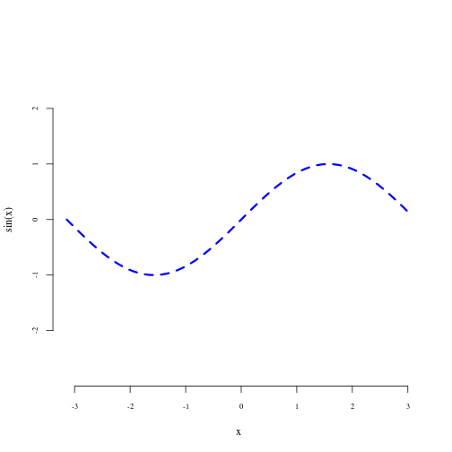
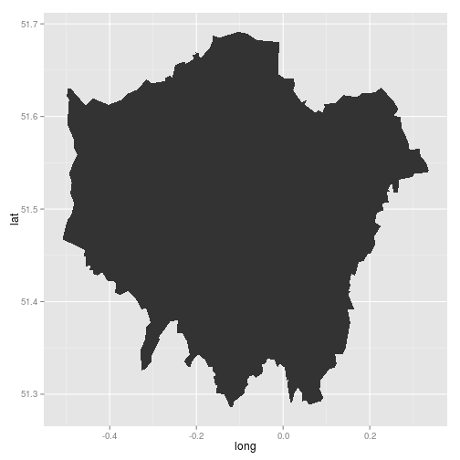
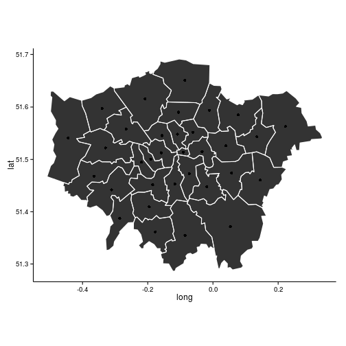
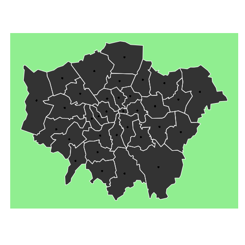
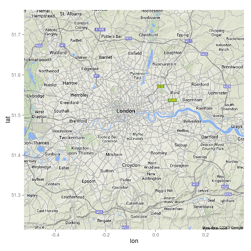
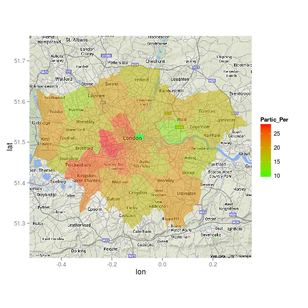
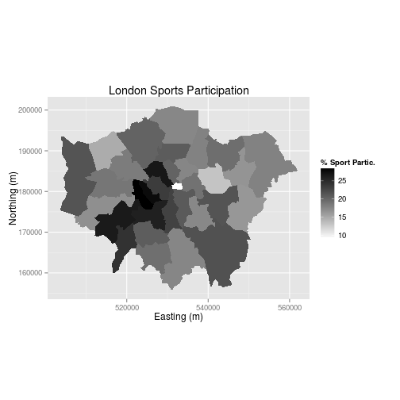
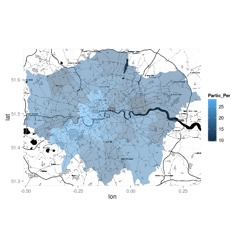

# Background maps in R
In this tutorial we will see how basic tweaks can make maps more readable and 
attractive, focussing on the addition of basemaps using the ggmap package. 
We assume little background knowledge of graphics in R, so begin with a basic graph
in R's basic graphics package. Then we will move on to the graphically superiour ggplot/ggmap
approach, to show how maps can be built as layers.

## Introduction: tweaking graphics in R
R has very powerful graphical functionality, but a reputation for being fiddly if 
you aim to create beautiful images, rather than the sparse yet functional base graphics
such as:

```r
x <- seq(from = -pi, to = pi, by = 0.1)
y <- sin(x)
plot(x, y)
```

 


It is quite easy to tweak the base graphics, with a few extra lines of code:

```r
par(family = "serif", font = 5)
plot(x,y, type = "line", col = "blue", 
     cex.axis = 0.7, # make axis labels smaller
     ylab = "sin(x)",
     lty = 2, # make the line dotted
     lwd = 3, # make line thicker
     bty = "n" # remove the bounding box
     ) # ...
```

```
## Warning: plot type 'line' will be truncated to first character
```

 

Although we will be using the more recent ggplot package, which works differently from R's base graphics,
the principles will be the same: you start with a basic representation of your data and add 
further details and optional bells and whistles as you proceed.

## Downloading and unzipping the files
Before proceeding, we first need some geographical data, ready for plotting.
R can handle almost any geographical data you through at it, provided the appropriate packages 
are installed. You can load data that's already on your computer; we assume you 
have no geographical data and download directly from the internet. 

You can download the files outside of R using a browser or any other method.
Because R has its own functions for downloading and unzipping files, 
and it's fun to see what else R can do beyond analysing and plotting data, 
we will download the files directly from the R command line.


```r
download.file(url = "http://spatialanalysis.co.uk/wp-content/uploads/2010/09/London_Sport.zip", 
    destfile = "London_Sport.zip")  # download file from the internet

list.files()  # shows what's in your working director - should include zip file
```

```
##  [1] "figure"           "ggmapTemp.png"    "london_sport.dbf"
##  [4] "london_sport.prj" "london_sport.sbn" "london_sport.sbx"
##  [7] "london_sport.shp" "london_sport.shx" "London_Sport.zip"
## [10] "overviews.html"   "overviews.md"     "overviews.Rmd"   
## [13] "README.md"
```

```r
unzip("London_Sport.zip")  # unzip the zip file
list.files()  # should have .shp file added
```

```
##  [1] "figure"           "ggmapTemp.png"    "london_sport.dbf"
##  [4] "london_sport.prj" "london_sport.sbn" "london_sport.sbx"
##  [7] "london_sport.shp" "london_sport.shx" "London_Sport.zip"
## [10] "overviews.html"   "overviews.md"     "overviews.Rmd"   
## [13] "README.md"
```


## Installing geographical packages
At present although we have the data files, there is very little we can do with 
them because geographical functions are lacking from R's base install.
Therefore we need to install them. It is important to think carefully about 
what packages will be needed in R for a given project and ensure they are 
loaded at the right time. There are 

To see what is currently installed, type the following:

```r
search()
```

```
##  [1] ".GlobalEnv"        "package:knitr"     "package:graphics" 
##  [4] "package:grDevices" "package:utils"     "package:datasets" 
##  [7] "package:plyr"      "package:foreign"   "package:reshape2" 
## [10] "package:ggplot2"   "package:stats"     "package:methods"  
## [13] "Autoloads"         "package:base"
```

As you can see, there are already multiple packages in the base installation. 
For plotting basemaps and geographical analysis more generally, however, 
we need more:

```r
SpatialPolygonsDataFrame
```

```
## Error: object 'SpatialPolygonsDataFrame' not found
```

```r
# install.packages('rgeos', 'sp') # uncomment this line if rgeos and sp
# are not already on your system
library(rgdal)  # add the powerful rgdal package - note that it automatically loads the sp package also
```

```
## Loading required package: sp
```

```
## rgdal: version: 0.8-9, (SVN revision 470) Geospatial Data Abstraction
## Library extensions to R successfully loaded Loaded GDAL runtime: GDAL
## 1.10.0, released 2013/04/24 but rgdal build and GDAL runtime not in sync:
## ... consider re-installing rgdal!! Path to GDAL shared files:
## /usr/share/gdal/1.10 Loaded PROJ.4 runtime: Rel. 4.8.0, 6 March 2012,
## [PJ_VERSION: 480] Path to PROJ.4 shared files: (autodetected)
```

```r
search()  # see the sp and rgeos packages has now been added
```

```
##  [1] ".GlobalEnv"        "package:rgdal"     "package:sp"       
##  [4] "package:knitr"     "package:graphics"  "package:grDevices"
##  [7] "package:utils"     "package:datasets"  "package:plyr"     
## [10] "package:foreign"   "package:reshape2"  "package:ggplot2"  
## [13] "package:stats"     "package:methods"   "Autoloads"        
## [16] "package:base"
```

```r
`?`(`?`(rgdal  # shows you what rgdal can do
))
head(SpatialPolygonsDataFrame)  # now you should see a load of code, telling you the command is available
```

```
##                                                   
## 1 function (Sr, data, match.ID = TRUE)            
## 2 {                                               
## 3     stopifnot(length(Sr@polygons) == nrow(data))
## 4     if (is.character(match.ID)) {               
## 5         row.names(data) = data[, match.ID[1]]   
## 6         match.ID = TRUE
```

If you need multiple R packages, you can save time by creating an object of you favourite packages.
Here some of my favourites (not run as we don't need all of them):

```r
x = c("ggplot2", "rgeos", "reshape2", "foreign", "plyr")
lapply(x, require, character.only = T)  # the R packages we'll be using
```

(Note: you may want to consider adding a line similar to this to your
[.Rprofile file](http://www.statmethods.net/interface/customizing.html), 
so they load when R initialises, if you use some packages frequently.
Some people put a lot of time into 
[their .Rprofiles!](http://stackoverflow.com/questions/1189759/expert-r-users-whats-in-your-rprofile).)

Packages can be 'unloaded' using the following command:

```r
# detach('package:rgdal', unload=TRUE) Do not run this, unless you want to
# remove rgdal functionality
```


## Basic maps with the sp package 

```r
lnd <- readOGR(dsn = ".", "london_sport")
```

```
## OGR data source with driver: ESRI Shapefile 
## Source: ".", layer: "london_sport"
## with 33 features and 4 fields
## Feature type: wkbPolygon with 2 dimensions
```

```r
plot(lnd)
```

 

Note that the plot is quite different from that displayed in the first plot:
it has not axes for example. What is going on here? The sp package actually comes 
with its own plotting command, which is called automatically if the plot is an S4 
object. So the actual command that is called is `sp::plot` or "use the plot function from the 
sp package" in plain English. The following code shows what's going on:

```r
# graphics::plot(lnd) # does not work
sp::plot(lnd)  # does work
```


We can add a few bells and whistles to this plot, but for beautiful maps 
harnessing the "grammar of graphics", we need to now transition to the ggplot 
approach.

## Basemaps with ggplot
In order to plot basemaps in R, we need to ensure that the basemap and the 
data are using the same coordinate system. Web maps use the 
[Web Merkator](http://spatialreference.org/ref/sr-org/7483/) system. The data
comes in OSGB19636:

```r
bbox(lnd)  # this tells us that we are in lat/long
```

```
##      min    max
## x 503571 561941
## y 155851 200932
```

```r
lnd <- (SpatialPolygonsDataFrame(Sr = spTransform(lnd, CRSobj = CRS("+init=epsg:4326")), 
    data = lnd@data))
```


```r
lnd.f <- fortify(lnd)
```

```
## Regions defined for each Polygons
```

```r
head(lnd@data)
```

```
##   ons_label                 name Partic_Per Pop_2001
## 0      00AF              Bromley       21.7   295535
## 1      00BD Richmond upon Thames       26.6   172330
## 2      00AS           Hillingdon       21.5   243006
## 3      00AR             Havering       17.9   224262
## 4      00AX Kingston upon Thames       24.4   147271
## 5      00BF               Sutton       19.3   179767
```

```r
head(lnd.f)
```

```
##      long   lat order  hole piece group id
## 1 0.03164 51.44     1 FALSE     1   0.1  0
## 2 0.04153 51.44     2 FALSE     1   0.1  0
## 3 0.06333 51.42     3 FALSE     1   0.1  0
## 4 0.07695 51.43     4 FALSE     1   0.1  0
## 5 0.10923 51.41     5 FALSE     1   0.1  0
## 6 0.13119 51.41     6 FALSE     1   0.1  0
```

```r
lnd$id <- row.names(lnd)  # provide same column names for join

lnd.f <- join(lnd.f, lnd@data)
```

```
## Joining by: id
```

```r
head(lnd.f)
```

```
##      long   lat order  hole piece group id ons_label    name Partic_Per
## 1 0.03164 51.44     1 FALSE     1   0.1  0      00AF Bromley       21.7
## 2 0.04153 51.44     2 FALSE     1   0.1  0      00AF Bromley       21.7
## 3 0.06333 51.42     3 FALSE     1   0.1  0      00AF Bromley       21.7
## 4 0.07695 51.43     4 FALSE     1   0.1  0      00AF Bromley       21.7
## 5 0.10923 51.41     5 FALSE     1   0.1  0      00AF Bromley       21.7
## 6 0.13119 51.41     6 FALSE     1   0.1  0      00AF Bromley       21.7
##   Pop_2001
## 1   295535
## 2   295535
## 3   295535
## 4   295535
## 5   295535
## 6   295535
```


### The simplest case
As with most things in R, there are many ways to create a ggplot graphic in R, and the 
same applies to maps.  Below we see two identical ways of creating the same plot.
(a third way would be to move the `data =` argument from geom_polygon and into ggplot).

```r
(p <- qplot(long, lat, group = group, geom = "polygon", data = lnd.f))
```

 

```r
# this line of code saves the plot as an object (p) because it's enclosed
# by bracets, it also plots the results

(q <- ggplot() + geom_polygon(data = lnd.f, aes(x = long, y = lat, group = group)))
```

 


The difference between the two ways of plotting becomes apparent when 
trying to plot objects that do not share the same dimensions as the data frame `lnd.f` (33).

```r
# (p1 <- p + geom_point(aes(x = coordinates(lnd)[,1], y =
# coordinates(lnd)[,2]))) the above code fails because the data frame is
# set for all layers in qplot - run only to test


(q1 <- q + geom_point(aes(x = coordinates(lnd)[, 1], y = coordinates(lnd)[, 
    2])))
```

 

```r
# this line of code succeeds because each layer has its own data
# associated with it
```


### Basic maps in ggplot2
The above images render fine, even with two layers, but it would be 
generous to describe them as fully fledged maps at present. This is 
because the coordinates are not correct and the background looks, well, 
more the background of a graph. We also cannot distinguish between the 
different polygons in these maps. These issues are resolved in the code below, 
building on the `q1` plot we saved above.

```r
(q2 <- q1 + 
  geom_path(data = lnd.f, aes(x = long, y = lat, group = group), color = "white") + 
  coord_map() + # this line of code ensures the plot is to scale
  theme_classic()  # this line removes the distracting grey background
 )
```

 


### Further modifications
ggplot2 has customisable themes. To make a map in a new style, we can first 
specify the theme that we want. Say you want a theme with no axes, just like 
the `sp::plot` function:

```r
theme_spmap <- theme(panel.background = element_rect(fill = "lightgreen"))
theme_spmap <- theme(axis.line = element_blank(), axis.ticks = element_blank(), 
    axis.title.x = element_blank(), axis.title.y = element_blank(), axis.text.y = element_blank(), 
    axis.text.x = element_blank(), axis.text.y = element_blank(), axis.text.y = element_blank(), 
    panel.background = element_rect(fill = "lightgreen")  # add a light green background, for fun
)
q2 + theme_spmap
```

 


### Basemaps

```r
library(ggmap)  # you may have to use install.packages to install it first
b <- bbox(lnd)
(lnd.b1 <- ggmap(get_map(location = b)))  # download map data for the lnd data and plot
```

```
## Warning: bounding box given to google - spatial extent only approximate.
```

```
## converting bounding box to center/zoom specification. (experimental)
```

```
## Map from URL :
## http://maps.googleapis.com/maps/api/staticmap?center=51.488791,-0.086622&zoom=10&size=%20640x640&scale=%202&maptype=terrain&sensor=false
```

```
## Google Maps API Terms of Service : http://developers.google.com/maps/terms
```

 

```r
lnd.b1 + geom_polygon(data = lnd.f, aes(x = long, y = lat, group = group, fill = Partic_Per), 
    alpha = 0.5) + scale_fill_continuous(low = "green", high = "red")  # add interesting scale
```

 

This is is getting better, but note that the map is square whilst the 
data is more rectangular. To do more things with the base map, we need to 
use a different source.


```r
lnd.b2 <- ggmap(get_map(location = b, source = "stamen", maptype = "toner", 
    crop = T))
lnd.b2 + geom_polygon(data = lnd.f, aes(x = long, y = lat, group = group, fill = Partic_Per), 
    alpha = 0.5)
```

 


To increase the resolution of the map, we use the zoom command. The `stamen` source 
can create multiple tiles; the standard Google maps source cannot


```r
lnd.b3 <- ggmap(get_map(location = b, source = "stamen", maptype = "toner", 
    crop = T, zoom = 11))
lnd.b3 + geom_polygon(data = lnd.f, aes(x = long, y = lat, group = group, fill = Partic_Per), 
    alpha = 0.5)
```

 


